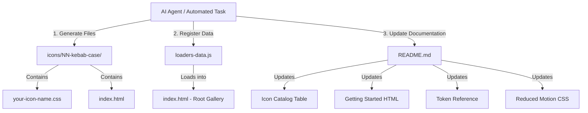

# Architectural & Structural Uniformity Blueprint

This document provides a deep architectural and structural analysis of the **LoadIcons** codebase. It outlines the conventions, templates, and patterns required to ensure complete uniformity across the repository. This blueprint serves as the strict operational guideline for any autonomous AI agent executing automatic background tasks (such as generating, registering, committing, and pushing new icons).

---

## 1. System Architecture & Data Flow

To safely automate the creation of new loading icons, the AI agent must understand how data and styles flow between the standalone folders and the central gallery dashboard.



---

## 2. Directory Structure & Naming Conventions

For any new icon added to the collection, the folders and files must adhere to a strict naming pattern based on kebab-case and sequential numbering.

* **Folder Path**: `icons/NN-kebab-case/`
  * `NN` must be a 2-digit zero-padded sequential number (e.g., `56`, `57`).
  * `kebab-case` must be lowercase alphanumeric characters separated by hyphens (e.g., `elastic-ripple`).
* **Standalone CSS Path**: `icons/NN-kebab-case/kebab-case.css` (filename matches the kebab-case suffix exactly).
* **Standalone HTML Path**: `icons/NN-kebab-case/index.html` (always exactly `index.html`).

---

## 3. Standalone CSS File Blueprint (`kebab-case.css`)

Every standalone CSS file must be highly structured, modular, and self-contained. It must follow the exact layout below to ensure visual consistency and predictability:

```css
/**
 * [Icon Name] — LoadIcons
 * ─────────────────────────────────────────────────────────────
 * Technique : [Brief description of the CSS animation technique used]
 * Usage     : Apply `.[kebab-case]` to the root element.
 *             [Brief instructions on required child markup, e.g. <span> counts]
 * ─────────────────────────────────────────────────────────────
 *
 * CONFIGURATION — edit the values below to suit your project.
 */

.[kebab-case] {
  /* === SIZE === */
  --loader-size:  36px;       /* root dimension of the component */
  
  /* === COLOR === */
  --loader-color: #7F77DD;    /* fill or border theme color */

  /* === ANIMATION === */
  --loader-speed: 1.0s;       /* duration of one full cycle */
  
  /* === CUSTOM TOKENS === */
  --[specific-token]: [value]; /* expose specific configurable values */

  /* ─── Do not edit below this line ─── */
  box-sizing: border-box;
  display: inline-flex;
  position: relative;
  width: var(--loader-size);
  height: var(--loader-size);
  flex-shrink: 0;
}

.[kebab-case] * {
  box-sizing: border-box;
}

/* Keyframe animations - MUST be namespaced with the kebab-case suffix */
@keyframes [kebab-case]-anim-name {
  0%   { ... }
  100% { ... }
}

/* ─── Size presets ─── */
.[kebab-case]--sm { --loader-size: 24px; }
.[kebab-case]--md { --loader-size: 36px; } /* default */
.[kebab-case]--lg { --loader-size: 48px; }

/* ─── Color presets ─── */
.[kebab-case]--primary { --loader-color: #7F77DD; }
.[kebab-case]--success { --loader-color: #1D9E75; }
.[kebab-case]--warning { --loader-color: #EF9F27; }
.[kebab-case]--danger  { --loader-color: #E24B4A; }
.[kebab-case]--white   { --loader-color: #ffffff; }
```

> [!IMPORTANT]
> All selectors, keyframes, and custom tokens must be cleanly namespaced with the exact `[kebab-case]` value of the folder name to avoid global CSS namespace collisions.

---

## 4. Standalone Interactive HTML Demo Blueprint (`index.html`)

The standalone demo file allows users to view and interact with all variants of a single loader offline. The HTML layout, typography, section order, and inline styles must be 100% uniform across all loaders.

```html
<!DOCTYPE html>
<html lang="en">
<head>
  <meta charset="UTF-8" />
  <meta name="viewport" content="width=device-width, initial-scale=1.0" />
  <title>[Icon Name] — LoadIcons</title>
  <link rel="stylesheet" href="[kebab-case].css" />
  <style>
    *, *::before, *::after { box-sizing: border-box; margin: 0; padding: 0; }
    body { font-family: system-ui, sans-serif; background: #f8f8f6; color: #1a1a1a; padding: 2rem; }
    h1   { font-size: 1.25rem; font-weight: 600; margin-bottom: .2rem; }
    .sub { font-size: .85rem; color: #666; margin-bottom: 2rem; }
    .section-title { font-size:.7rem; text-transform:uppercase; letter-spacing:.08em; color:#aaa; margin-bottom:1rem; }
    .demo-row  { display:flex; align-items:center; gap:2.5rem; flex-wrap:wrap; margin-bottom:2.5rem; }
    .demo-block { display:flex; flex-direction:column; align-items:center; gap:.65rem; }
    .demo-block span { font-size:.75rem; color:#888; }
    .dark-bg { background:#1a1a1a; padding:1.25rem 1.75rem; border-radius:8px; }
    pre { background:#f0f0ee; border-radius:8px; padding:1rem; font-size:.78rem; overflow-x:auto; color:#333; }
  </style>
</head>
<body>
  <h1>NN · [Icon Name]</h1>
  <p class="sub">[Short description of the loader behavior and its ideal use cases].</p>

  <h2 class="section-title">Size variants</h2>
  <div class="demo-row">
    <div class="demo-block">
      <div class="[kebab-case] [kebab-case]--sm">[Child elements]</div>
      <span>sm · 24px</span>
    </div>
    <div class="demo-block">
      <div class="[kebab-case] [kebab-case]--md">[Child elements]</div>
      <span>md · 36px (default)</span>
    </div>
    <div class="demo-block">
      <div class="[kebab-case] [kebab-case]--lg">[Child elements]</div>
      <span>lg · 48px</span>
    </div>
  </div>

  <h2 class="section-title">Color presets</h2>
  <div class="demo-row">
    <div class="demo-block"><div class="[kebab-case] [kebab-case]--primary">[Child elements]</div><span>primary</span></div>
    <div class="demo-block"><div class="[kebab-case] [kebab-case]--success">[Child elements]</div><span>success</span></div>
    <div class="demo-block"><div class="[kebab-case] [kebab-case]--warning">[Child elements]</div><span>warning</span></div>
    <div class="demo-block"><div class="[kebab-case] [kebab-case]--danger">[Child elements]</div><span>danger</span></div>
    <div class="demo-block dark-bg">
      <div class="[kebab-case] [kebab-case]--white">[Child elements]</div>
      <span style="color:#555">white</span>
    </div>
  </div>

  <h2 class="section-title">Extended: Custom overrides</h2>
  <div class="demo-row">
    <div class="demo-block">
      <div class="[kebab-case]" style="--loader-color:#e05c97;">[Child elements]</div>
      <span>custom color</span>
    </div>
    <div class="demo-block">
      <div class="[kebab-case]" style="--loader-size:30px;--loader-speed:2s;">[Child elements]</div>
      <span>slow & custom size</span>
    </div>
  </div>

  <h2 class="section-title">Quick usage</h2>
  <pre>&lt;link rel="stylesheet" href="[kebab-case].css" /&gt;

&lt;div class="[kebab-case]" role="status" aria-label="Loading"&gt;
  [Child elements markup]
&lt;/div&gt;</pre>
</body>
</html>
```

---

## 5. Central Registry Schema (`loaders-data.js`)

To register the icon into the main interactive page, the AI agent must append a structured JavaScript object to the `loaders` array.

```javascript
	{
		id: "NN",
		name: "[Icon Name]",
		category: "[spinners/waves/3d/special]",
		tags: ["[tag1]", "[tag2]", "[tag3]"],
		html: `[HTML structural markup matching index.html structure]`,
		css: `[Optimized preview CSS reacting to global variables]`
	},
```

### Preview CSS vs Standalone CSS (Crucial Architectural Rule)
Inside `loaders-data.js`, the CSS must **not** hardcode standard local custom properties like `--loader-size: 36px` or `--loader-speed: 1s` in the root class. Instead, it must map its rules directly to global variables provided by the interactive gallery customizer sidebar:

| Visual Attribute | Standalone CSS Rule | Interactive Preview CSS Rule |
| ---------------- | ------------------- | ---------------------------- |
| **Dimensions** | `width: var(--loader-size);` | `width: var(--loader-size);` or `transform: scale(calc(var(--loader-size) / 32px));` (if position: absolute is used) |
| **Speed/Scale** | `animation-duration: var(--loader-speed);` | `animation-duration: calc([base-duration] * var(--loader-speed-scale));` |
| **Cycles** | `animation-iteration-count: infinite;` | `animation-iteration-count: var(--loader-cycles);` |
| **Colors** | `background-color: var(--loader-color);` | `background-color: var(--color-primary);` (or success/warning/danger mapped semantically) |
| **Surfaces** | `background: #ffffff;` | `background: var(--surface);` / `border: 1px solid var(--border);` |

---

## 6. Global Documentation Synchronization (`README.md`)

When adding a new icon, the AI agent must update **five distinct regions** in the root [README.md](file:///c:/Users/Lenovo/VSC/GitHub/loading-icon/README.md) to keep documentation in sync.

1. **Icon Catalog Table (lines 25-83)**:
   Add a row in the correct numerical order:
   ```markdown
   | NN | [[Icon Name]](icons/NN-kebab-case/) | `[CSS properties used]` | [Ideal use case description] |
   ```
2. **Getting Started HTML Snippet (lines 115-385)**:
   Insert the minimal HTML usage markup corresponding to the icon's sequential ID number:
   ```html
   <!-- NN · [Icon Name] -->
   <div class="[kebab-case]" role="status" aria-label="Loading">
     [Child element spans if any]
   </div>
   ```
3. **Token Reference Table (lines 431-483)**:
   Add custom token descriptions for the standalone stylesheet:
   ```markdown
   | [Icon Name] | `--loader-size` `--loader-color` `--loader-speed` [specific properties] |
   ```
4. **Repository Structure Directory Tree (lines 499-656)**:
   Add the folder entry inside the directory visual layout block:
   ```text
       ├── NN-kebab-case/
       │   ├── kebab-case.css
       │   └── index.html
   ```
5. **Reduced Motion Accessibility CSS list (lines 691-725)**:
   Add the class selectors or child element selectors inside the `@media (prefers-reduced-motion: reduce)` block to ensure the new icon's animation respects system user preferences:
   ```css
   .[kebab-case], .[kebab-case] > span
   ```

---

## 7. Operational Checklist for Background AI Auto-Execution

Every background automated execution session *must* execute these exact operational steps sequentially to ensure flawless, error-free integration:

- [ ] **Step 1: Check Current Database State**
  * Read [loaders-data.js](file:///c:/Users/Lenovo/VSC/GitHub/loading-icon/loaders-data.js) and determine the current maximum sequential ID `NN` (e.g. `55`) to calculate the next sequence number `NN + 1`.
- [ ] **Step 2: Design Unique Concept**
  * Generate a completely unique, novel CSS animation mechanism not present in the current 55 loaders (referring to `Uniqueness & Novelty Guidelines` in `CONTRIBUTING.md`).
- [ ] **Step 3: Create Folder & Standalone CSS**
  * Create `icons/NN-kebab-case/` folder and write `kebab-case.css` exposing all parameters via local custom properties.
- [ ] **Step 4: Create Standalone HTML Demo**
  * Write `index.html` inside the folder following the structured demo layout showing all sizes, colors, custom overrides, and a Quick Usage block.
- [ ] **Step 5: Register to Dynamic Database**
  * Add the loader object to [loaders-data.js](file:///c:/Users/Lenovo/VSC/GitHub/loading-icon/loaders-data.js) adapting dimensions and duration to the customizer's reactive variables (`var(--loader-size)`, `var(--loader-speed-scale)`, etc.).
- [ ] **Step 6: Sync Documentation**
  * Update all five distinct regions in [README.md](file:///c:/Users/Lenovo/VSC/GitHub/loading-icon/README.md) sequentially.
- [ ] **Step 7: Run Automated Verification Tests**
  * Proactively execute syntax checks and structural validation scripts (e.g. running lint rules or local tests) to guarantee 100% correctness.
- [ ] **Step 8: Git Commit & Push Branch**
  * Checkout a branch named `feat/NN-kebab-case`, add all files (using `-f` for `CONTRIBUTING.md` if modified), commit using conventional message format `feat: add NN-kebab-case loader`, and push the branch.
